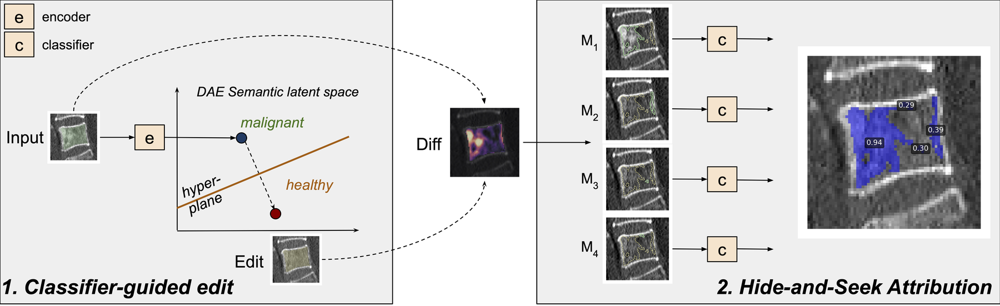
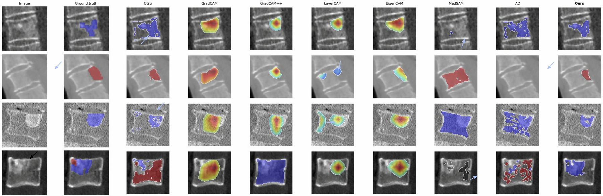

# Hide-and-Seek Attribution: Weakly Supervised Segmentation of Vertebral Metastases in CT

**[Paper](https://arxiv.org/abs/2512.06849)** · **[OpenReview](https://openreview.net/forum?id=67rdM3iofG)**



---

## Abstract

Accurate segmentation of vertebral metastasis in CT is clinically important yet difficult to scale, as voxel-level annotations are scarce and both lytic and blastic lesions often resemble benign degenerative changes. We introduce a 2D weakly supervised method trained solely on vertebra-level healthy/malignant labels, without any lesion masks. The method combines a Diffusion Autoencoder (DAE) that produces a classifier-guided healthy edit of each vertebra with pixel-wise difference maps that propose suspect candidate lesions. To determine which regions truly reflect malignancy, we introduce Hide-and-Seek Attribution: each candidate is revealed in turn while all others are hidden, the edited image is projected back to the data manifold by the DAE, and a latent-space classifier quantifies the isolated malignant contribution of that component. High-scoring regions form the final lytic or blastic segmentation. On held-out radiologist annotations, we achieve strong blastic/lytic performance despite no mask supervision (F1: 0.91/0.85; Dice: 0.87/0.78), exceeding baselines (F1: 0.79/0.67; Dice: 0.74/0.55). These results show that vertebra-level labels can be transformed into reliable lesion masks, demonstrating that generative editing combined with selective occlusion supports accurate weakly supervised segmentation in CT.

---



---

## Quick Start

**To run the demo notebook on the bundled sample:**

```bash
# 1. Clone the repo
git clone https://github.com/[YOUR_USERNAME]/hide_and_seek.git
cd hide_and_seek

# 2. Create environment and install dependencies
conda create -n hide_and_seek python=3.11 -y
conda activate hide_and_seek
pip install -r requirements.txt

# 3. Download the pretrained DAE checkpoint from Hugging Face
mkdir -p checkpoints/fxclass64_autoenc
hf download matanatad/dae_verts last.ckpt \
    --local-dir checkpoints/fxclass64_autoenc

# 4. Launch the notebook
jupyter notebook notebooks/hide_and_seek_demo.ipynb
```

The pretrained classifier and scaler (`checkpoints/classifier_lr.pkl`, `checkpoints/scaler.pkl`) are already included in the repo. A real anonymized CT vertebra patch is bundled under `data/sample/` so the notebook runs out of the box.

> The DAE checkpoint can also be downloaded automatically the first time the notebook is run.

---

## Training from Scratch

To train your own model on a new dataset:

### Step 1 — Prepare your dataset manifest

Create an Excel file (`.xlsx`) with columns:

| image | seg_msk | label |
|---|---|---|
| /path/to/vert.nii | /path/to/seg.nii | 0 |
| /path/to/vert.nii | /path/to/seg.nii | 1 |

- `image`: path to a 3D NIfTI CT vertebra crop (64×64×64 recommended)
- `seg_msk`: binary vertebral body segmentation mask (same shape)
- `label`: 0 = healthy, 1 = malignant

### Step 2 — Train the DAE

Edit `src/run_fxclass64.py` to set your manifest path and GPU, then:

```bash
conda activate hide_and_seek
cd src
python run_fxclass64.py
```

Training uses PyTorch Lightning with W&B logging. The checkpoint is saved to `checkpoints/fxclass64_autoenc/`.

### Step 3 — Train the latent-space classifier

```bash
jupyter notebook notebooks/train_latent_classifier.ipynb
```

This encodes your full dataset into the DAE latent space, fits a logistic regression classifier via grid search, and saves `classifier_lr.pkl` + `scaler.pkl` to `checkpoints/`.

---

## Repository Structure

```
├── src/                    # All Python source code
│   ├── model/              # UNet + autoencoder architecture
│   ├── diffusion/          # DDPM/DDIM diffusion utilities
│   ├── experiment.py       # PyTorch Lightning training loop
│   ├── config.py           # TrainConfig dataclass
│   ├── templates.py        # Named experiment configurations
│   └── run_fxclass64.py    # DAE training entry point
├── notebooks/
│   ├── hide_and_seek_demo.ipynb        # Segmentation demo (run this first)
│   └── train_latent_classifier.ipynb  # Encode dataset + train classifier
├── data/sample/            # Bundled anonymized CT vertebra sample
├── assets/                 # Figures for this README
├── checkpoints/            # Pretrained classifier + scaler (DAE downloaded separately)
└── requirements.txt
```

---

## Citation

```bibtex
@article{atad2025hideandseek,
  title={Hide-and-Seek Attribution: Weakly Supervised Segmentation of Vertebral Metastases in CT},
  author={Atad, Matan and Marka, Alexander W. and Steinhelfer, Lisa and Curto-Vilalta, Anna
          and Leonhardt, Yannik and Foreman, Sarah C. and Dietrich, Anna-Sophia Walburga
          and Graf, Robert and Gersing, Alexandra S. and Menze, Bjoern and Rueckert, Daniel
          and Kirschke, Jan S. and M{\"o}ller, Hendrik},
  journal={arXiv preprint arXiv:2512.06849},
  year={2025},
  doi={10.48550/arXiv.2512.06849}
}
```

---

## License

MIT License — see [LICENSE](LICENSE).
